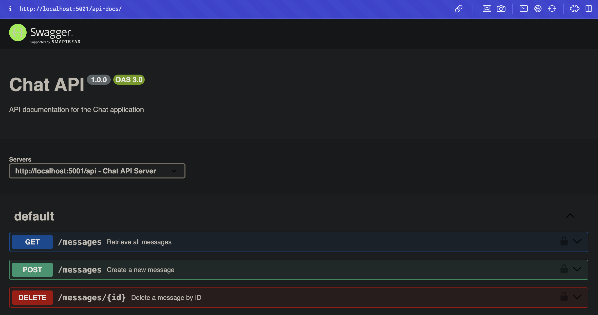
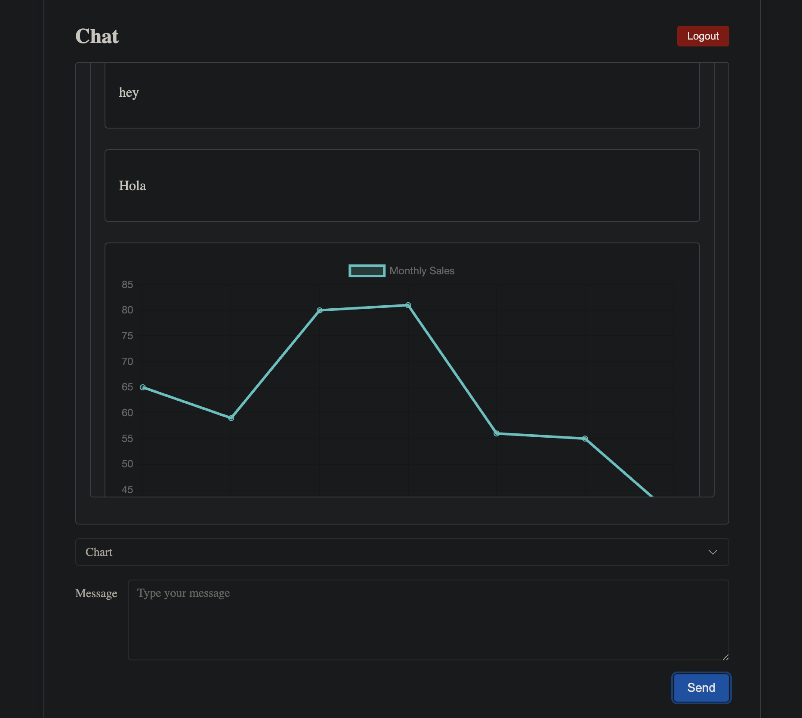
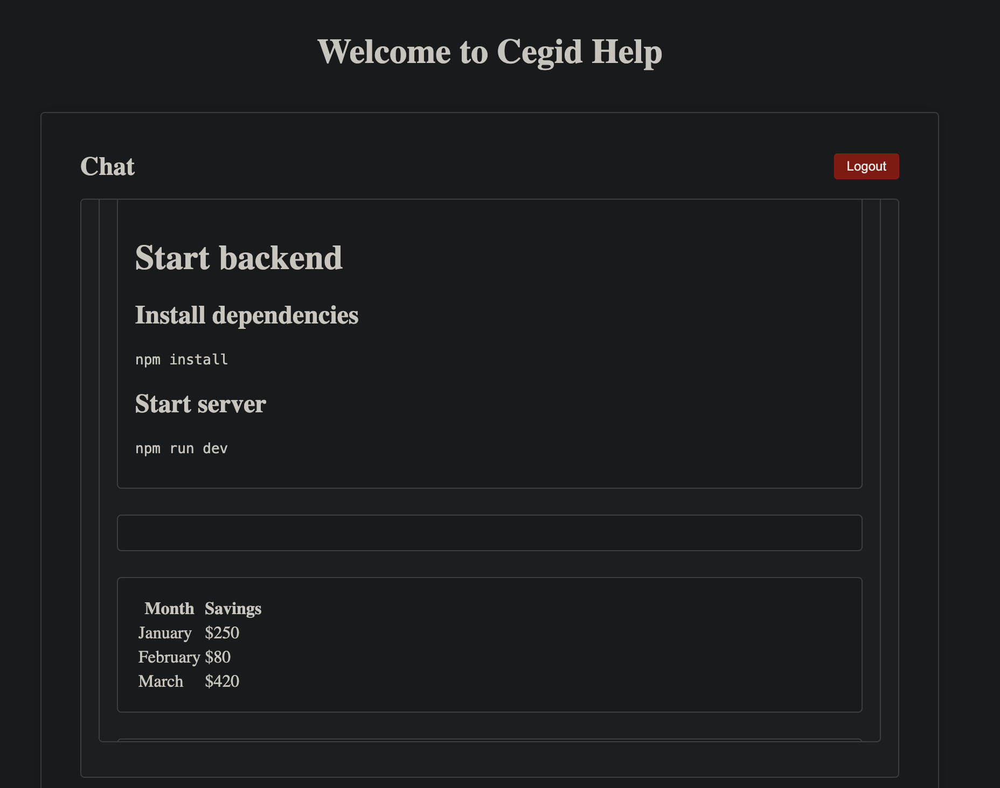
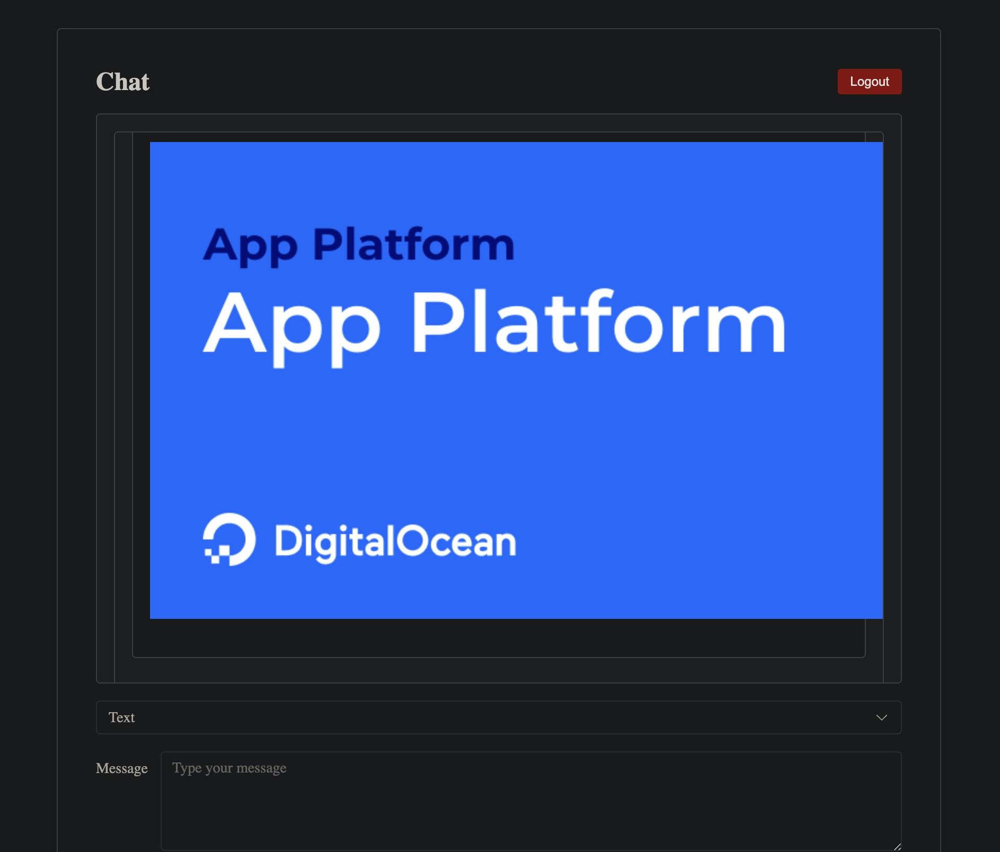

# Start backend

## Install dependencies

```bash
npm install
```

## Start server for backend and frontend

```bash
npm run dev
```

## Testing API with Postman

Just import CEGID.postman_collection.json in Postman and test login/logout and send message routes

## Select the type of message

- Text message/markdown- You can put markdown directly

* Image

```

```

- Chart

```
{
  "labels": ["January", "February", "March", "April", "May", "June", "July"],
  "datasets": [
    {
      "label": "Monthly Sales",
      "data": [65, 59, 80, 81, 56, 55, 40],
      "borderColor": "rgba(75, 192, 192, 1)",
      "backgroundColor": "rgba(75, 192, 192, 0.2)",
      "fill": true
    }
  ]
}
```

## API Docs

Swagger API Docs: http://localhost:5001/api-docs/swagger-ui/



## Demo Images





## Tests [WIP]

### Backend - jest unit tests

```bash
npm run test
```

### Frontend - playwright end-to-end tests

```bash
npm run e2e
```

# TODO List

- [ ] Jest Test
- [ ] Docker
- [ ] Docker Compose
- [ ] CI/CD
- [ ] Swagger
- [x] Lint
- [x] Prettier
- [x] Husky
- [x] Logger
- [x] Commitlint
- [x] Eslint
- [x] Editorconfig
- [x] Gitignore
- [x] Dockerignore
- [x] .env
- [x] .env.example
- [x] .env.test
- [x] .env.test.example
- [x] .env.prod
- [x] .env.prod.example
- [x] .env.dev
- [x] .env.dev.example
- [x] .env.local
- [x] .env.local.example
- [x] .env.development
- [x] .env.development.example
- [x] .env.staging
- [x] .env.staging.example
- [x] .env.production
- [x] .env.production.example
- [x] .env.local
- [x] .env.local.example
- [x] .env.development.local
- [x] .env.development.local.example
- [x] .env.staging.local
- [x] .env.staging.local.example
- [x] .env.production.local
- [x] .env.production.local.example
- [x] .env.test.local
- [x] .env.test.local.example
- [x] .env.prod.local
- [x] .env.prod.local.example

# License

MIT
